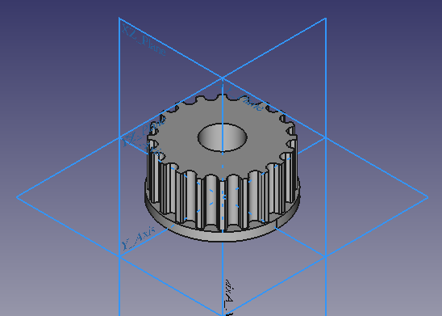
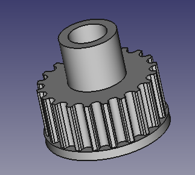
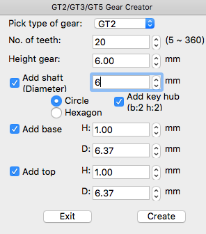
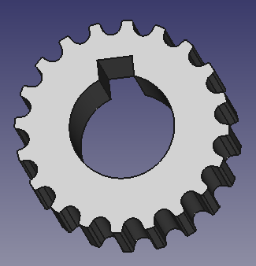
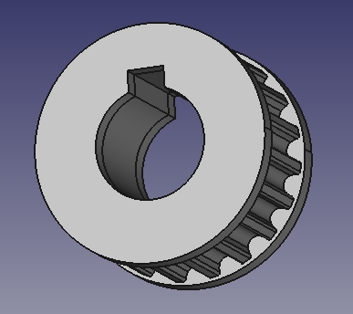
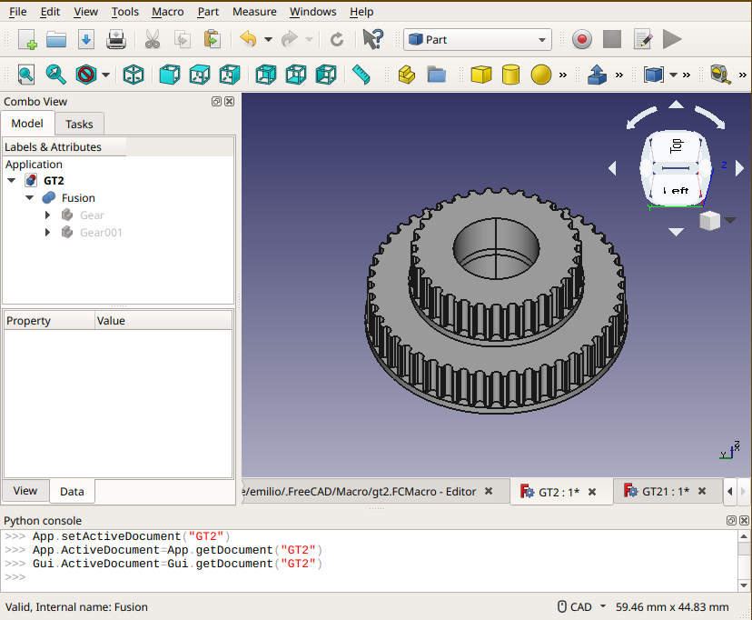

# GT2/GT3/GT5 Freecad Macro 
(For more information about Freecad please visit https://www.freecadweb.org)

It's a Freecad Macro that will allow you to create GT (2/3/5) gear models with ease.

Just select some parameter in the UI and click the generate button and that's it!

# How to add the macro to Freecad
This is not the official way to do it I'm explaining just a fast and simple steps so you will be able to run the macro inside Freecad
- Download Freecad from https://www.freecadweb.org/downloads.php and install it.
- From the top bar select the main Macros menu and click over the Macros... option.
- A dialog named Execute Macro will appear on the screen.
- Press the Create Button to create a new macro.
- It will appear a popup to ask you the name of the new macro, just type "GT2" (or the name of your preference) 
- A new text editor window will appear on your Freecad.
- Copy and paste the GT2.py inside it.
- At the top of the screen the is a play button to that will execute the macro.
- The macro will display a popup window named GT2/GT3/GT5 Gear Creator . 

 The next time you press the Macros/Macros... menu option your new macro will be there, so you will need just to press the Execute button to show the GT2/GT3/GT5 Gear Creator UI.

# Version History

* Version 1.4:
- Fixing bugs related to size of top and base
- Adding code to keep dialog upfront main window
- Adding GT3 and GT5

* Version 1.3:
- Adding key for shaft hub
- Fixing issue with top
- Fixing issue with shaft (now values are in diameter)

* Version 1.2:
- Add a top and bottom to the gear
- Customize the size and height  of the top/bottom.

* Version 1.1:
- Fixing code to run in Freecad 18

* Version 1.0:
- First release running on Freecad 17
- Adding shaft hole (circle or hexagon)
- Basic GT2 Gear creator

# Merging Two Gears 

Run the script and create two pulleys:

- First pulley (document GT2) 50 teeth, shaft 5mm with base
- Second pulley (document GT21) 32 teeth, shaft 5mm with base
- In document GT21 select the Gear object from the tree-view
- Then Ctrl+C for copy
- Go to document GT2
- Select the GT2 document from the treeview and do a Ctrl+P
- Then You will end with a Gear001 object.
- Select this object and right click the mouse to show the menu
- Select transform
- Move it upwards (Z axis) 6mm (or the height of your other pulley)
- Then select both Gear and Gear001 objects, go to Part Module and do a Fusion
- That's it!
